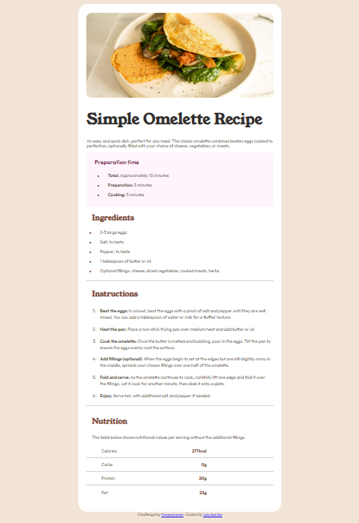

# Frontend Mentor - Recipe page solution

This is a solution to the [Recipe page challenge on Frontend Mentor](https://www.frontendmentor.io/challenges/recipe-page-KiTsR8QQKm). Frontend Mentor challenges help you improve your coding skills by building realistic projects. 

## Table of contents

- [Overview](#overview)
  - [The challenge](#the-challenge)
  - [Screenshot](#screenshot)
  - [Links](#links)
- [My process](#my-process)
  - [Built with](#built-with)
  - [What I learned](#what-i-learned)
  - [Continued development](#continued-development)
  - [Useful resources](#useful-resources)
- [Author](#author)
- [Acknowledgments](#acknowledgments)

## Overview

### Screenshot



### Links

- Solution URL: https://github.com/LailaShakBan7/Recipe-Page-FM.git
- Live Site URL: https://lailashakban7.github.io/Recipe-Page-FM/


### Built with

- Semantic HTML5 markup
- CSS custom properties

### What I learned

Getting paragraphs and content to align and span as close to the design as possible. Also, I had to experiment with parent-child elements for the first time. 


```html
.Nutrition-values p {
    font-family: var(--ff-main);
    font-weight: var(--fw-400);
    font-size: var(--ff-main);
    color: var(--clr-Wenge-Brown);
    text-align: left;
    padding-left: 55px;
    padding-bottom: 15px;
    border-bottom: 1.5px solid lightgrey;
}

.Nutrition-values span {
    font-family: var(--ff-main);
    font-weight: var(--fw-700);
    color: var(--clr-Nutmeg);
    float: right;
    padding-right: 220px;
}
```

### Continued development

I will continue watching tutorials on CSS especially for width and height properties. 

### Useful resources

https://www.youtube.com/watch?v=_210OoKzZoE

https://www.youtube.com/watch?v=tlp4SqPqP5U


## Author

- Frontend Mentor - [@LailaShakBan7](https://www.frontendmentor.io/profile/LailaShakBan7)

